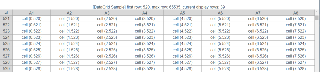

# DataGrid
A sample implementation of a large table view that behaves like an Excel spreadsheet implemented in Vue3.




## Summary
Obviously, displaying a spreadsheet with thousands of rows in a browser takes a long time to display. 
Therefore, by tagging only the area currently displayed by the browser, the cost required for rendering the browser is reduced. 
Inconsistencies that occur when scrolling pages are resolved with JavaScript.

## Features
- Clear and concise tag structure
- High speed because only the display range is rendered
- Easy to learn and improve because it is implemented in the popular Vue3.

## Demo

https://kanryu.github.io/DataGrid/

## Project setup
```
yarn install
```

### Compiles and hot-reloads for development
```
yarn serve
```

### Compiles and minifies for production
```
yarn build
```

### Lints and fixes files
```
yarn lint
```

### Customize configuration
See [Configuration Reference](https://cli.vuejs.org/config/).
